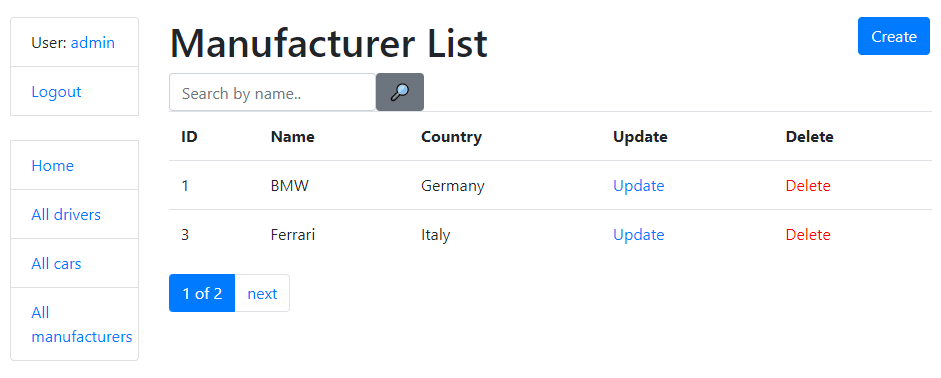

# Taxi Service Project

Django project for managing cars and drivers in Taxi Service

## Check it out!

[Taxi Service project deployed to Heroku]()

## Installation

Python3 must be already installed

```shell
git clone https://github.com/DHushchyk/library.git
cd library
python3 -m venv venv
source venv/bin/activate
pip install -r requirements.txt
python manage.py runserver
```

## Features

* Authentication functionality for Admin/User
* Managing cars drivers & manufacturers directory from website
* Powerful admin panel for advanced managing


## Test User
* username: user_test
* password fgwg6w4f6s464dfg


## Demo

